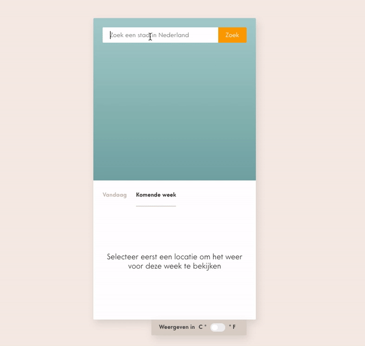

# Weather App Tutorial

Deze tutorial is ontwikkelt om je stapsgewijs wegwijs te maken in de wat meer advanced concepten van React, naar
aanleiding van de content uit de cursus **React** op EdHub.

Het project is opgezet met [Create React App](https://github.com/facebook/create-react-app).

## Eindresultaat

Wanneer je de volledige tutorial afgerond hebt, zal de webpagina er zo uit komen te zien:

## De applicatie starten

Als je het project gecloned hebt naar jouw locale machine, installeer je eerst de node_modules door het volgende
commando in de terminal te runnen:

`npm install`

Wanneer dit klaar is, kun je de applicatie starten met behulp van:

`npm start`

of gebruik de WebStorm knop (npm start). Open http://localhost:3000 om de pagina in de browser te bekijken. Begin met
het maken van wijzigingen in `src/App.js`: elke keer als je een bestand opslaat, zullen de wijzigingen te zien zijn op
de webpagina.

## Tussenstappen en antwoord-branches bekijken

De tutorial werkt in stapjes. Na elke stap kun je de bijbehorende branch bekijken om te zien hoe de applicatie er op dat
moment uit zou moeten zien of de Githistory doorlopen. Let hierbij wel op dat je eerst even naar het begin moet door een aantal keer op de  `<--`-toets te drukken, om daarna in chronologische volgorde door de commits te lopen.

### Stap 1: Weersvoorspelling Utrecht ophalen

*Branch* `stap-1-weersvoorspelling-ophalen`

| Bestand  | Tussenstappen                                                | Overzicht                                                    |
| -------- | ------------------------------------------------------------ | ------------------------------------------------------------ |
| *App.js* | [Githistory](https://github.githistory.xyz/hogeschoolnovi/frontend-react-weatherapp-tutorial/blob/stap-1-weersvoorspelling-ophalen/src/App.js) | [Eindresultaat](https://github.com/hogeschoolnovi/frontend-react-weatherapp-tutorial/blob/stap-1-weersvoorspelling-ophalen/src/App.js) |

### Stap 2: Zoektermen doorgeven

*Branch* `stap-2-zoektermen-doorgeven`

| Bestand        | Tussenstappen                                                | Overzicht                                                    |
| -------------- | ------------------------------------------------------------ | ------------------------------------------------------------ |
| *App.js*       | [Githistory](https://github.githistory.xyz/hogeschoolnovi/frontend-react-weatherapp-tutorial/blob/stap-1-weersvoorspelling-ophalen/src/App.js) | [Eindresultaat](https://github.com/hogeschoolnovi/frontend-react-weatherapp-tutorial/blob/stap-2-zoektermen-doorgeven/src/App.js) |
| *SearchBar.js* | [Githistory](https://github.githistory.xyz/hogeschoolnovi/frontend-react-weatherapp-tutorial/blob/stap-2-zoektermen-doorgeven/src/components/searchBar/SearchBar.js) | [Eindresultaat](https://github.com/hogeschoolnovi/frontend-react-weatherapp-tutorial/blob/stap-2-zoektermen-doorgeven/src/components/searchBar/SearchBar.js) |

### Stap 3: Zoeken wanneer user-input veranderd

*Branch* `stap-3-dynamisch-zoeken`

| Bestand  | Tussenstappen                                                | Overzicht                                                    |
| -------- | ------------------------------------------------------------ | ------------------------------------------------------------ |
| *App.js* | [Githistory](https://github.githistory.xyz/hogeschoolnovi/frontend-react-weatherapp-tutorial/blob/stap-3-dynamisch-zoeken/src/App.js) | [Eindresultaat](https://github.com/hogeschoolnovi/frontend-react-weatherapp-tutorial/blob/stap-3-dynamisch-zoeken/src/App.js) |

### Stap 4: Conditionele properties doorgeven

*Branch* `stap-4-data-conditioneel-doorgeven`

| Bestand          | Tussenstappen                                                | Overzicht                                                    |
| ---------------- | ------------------------------------------------------------ | ------------------------------------------------------------ |
| *App.js*         | [Githistory](https://github.githistory.xyz/hogeschoolnovi/frontend-react-weatherapp-tutorial/blob/stap-4-data-conditioneel-doorgeven/src/App.js) | [Eindresultaat](https://github.com/hogeschoolnovi/frontend-react-weatherapp-tutorial/blob/stap-4-data-conditioneel-doorgeven/src/App.js) |
| *ForecastTab.js* | [Githistory](https://github.githistory.xyz/hogeschoolnovi/frontend-react-weatherapp-tutorial/blob/stap-4-data-conditioneel-doorgeven/src/pages/forecastTab/ForecastTab.js) | [Eindresultaat](https://github.com/hogeschoolnovi/frontend-react-weatherapp-tutorial/blob/stap-4-data-conditioneel-doorgeven/src/pages/forecastTab/ForecastTab.js) |

### Stap 5: Meerdere voorspellingen weergeven door data-iteratie

*Branch* `stap-5-data-iteratie-en-keys`

| Bestand          | Tussenstappen                                                | Overzicht                                                    |
| ---------------- | ------------------------------------------------------------ | ------------------------------------------------------------ |
| *ForecastTab.js* | [Githistory](https://github.githistory.xyz/hogeschoolnovi/frontend-react-weatherapp-tutorial/blob/stap-5-data-iteratie-en-keys/src/pages/forecastTab/ForecastTab.js) | [Eindresultaat](https://github.com/hogeschoolnovi/frontend-react-weatherapp-tutorial/blob/stap-5-data-iteratie-en-keys/src/pages/forecastTab/ForecastTab.js) |

### Stap 6: Errors afhandelen en weergeven op de pagina

*Branch* `stap-6-error-afhandeling`

| Bestand          | Tussenstappen                                                | Overzicht                                                    |
| ---------------- | ------------------------------------------------------------ | ------------------------------------------------------------ |
| *App.js*         | [Githistory](https://github.githistory.xyz/hogeschoolnovi/frontend-react-weatherapp-tutorial/blob/stap-6-error-afhandeling/src/App.js) | [Eindresultaat](https://github.com/hogeschoolnovi/frontend-react-weatherapp-tutorial/blob/stap-6-error-afhandeling/src/App.js) |
| *ForecastTab.js* | [Githistory](https://githistory.xyz/hogeschoolnovi/frontend-react-weatherapp-tutorial/blob/stap-6-error-afhandeling/src/pages/forecastTab/ForecastTab.js) | [Eindresultaat](https://github.com/hogeschoolnovi/frontend-react-weatherapp-tutorial/blob/stap-6-error-afhandeling/src/pages/forecastTab/ForecastTab.js) |

### Stap 7: Laadtijden afhandelen en weergeven op de pagina

*Branch* `stap-7-laadtijd-afhandeling`

| Bestand          | Tussenstappen                                                | Overzicht                                                    |
| ---------------- | ------------------------------------------------------------ | ------------------------------------------------------------ |
| *ForecastTab.js* | [Githistory](https://githistory.xyz/hogeschoolnovi/frontend-react-weatherapp-tutorial/blob/stap-7-laadtijd-afhandeling/src/pages/forecastTab/ForecastTab.js) | [Eindresultaat](https://github.com/hogeschoolnovi/frontend-react-weatherapp-tutorial/blob/stap-7-laadtijd-afhandeling/src/pages/forecastTab/ForecastTab.js) |

### Stap 8: Tabbladen implementeren

*Branch* `stap-8-tabbladen`

| Bestand         | Tussenstappen                                                | Overzicht                                                    |
| --------------- | ------------------------------------------------------------ | ------------------------------------------------------------ |
| *App.js*        | [Githistory](https://githistory.xyz/hogeschoolnovi/frontend-react-weatherapp-tutorial/blob/stap-8-tabbladen/src/App.js) | [Eindresultaat](https://github.com/hogeschoolnovi/frontend-react-weatherapp-tutorial/blob/stap-8-tabbladen/src/App.js) |
| *TabBarMenu.js* | [Githistory](https://githistory.xyz/hogeschoolnovi/frontend-react-weatherapp-tutorial/blob/stap-8-tabbladen/src/components/tabBarMenu/TabBarMenu.js) | [Eindresultaat](https://github.com/hogeschoolnovi/frontend-react-weatherapp-tutorial/blob/stap-8-tabbladen/src/components/tabBarMenu/TabBarMenu.js) |

### Stap 9: Helperfuncties externaliseren en inzetten

*Branch* `stap-9-helper-functies`

| Bestand               | Tussenstappen                                                | Overzicht                                                    |
| --------------------- | ------------------------------------------------------------ | ------------------------------------------------------------ |
| *App.js*              | [Githistory](https://githistory.xyz/hogeschoolnovi/frontend-react-weatherapp-tutorial/blob/stap-9-helper-functies/src/App.js) | [Eindresultaat](https://github.com/hogeschoolnovi/frontend-react-weatherapp-tutorial/blob/stap-9-helper-functies/src/App.js) |
| *ForecastTab.js*      | [Githistory](https://github.githistory.xyz/hogeschoolnovi/frontend-react-weatherapp-tutorial/blob/stap-9-helper-functies/src/pages/forecastTab/ForecastTab.js) | [Eindresultaat](https://github.com/hogeschoolnovi/frontend-react-weatherapp-tutorial/blob/stap-9-helper-functies/src/pages/forecastTab/ForecastTab.js) |
| *TodayTab.js*         | [Githistory](https://github.githistory.xyz/hogeschoolnovi/frontend-react-weatherapp-tutorial/blob/stap-9-helper-functies/src/pages/todayTab/TodayTab.js) | [Eindresultaat](https://github.com/hogeschoolnovi/frontend-react-weatherapp-tutorial/blob/stap-9-helper-functies/src/pages/todayTab/TodayTab.js) |
| *kelvinToCelsius.js*  | [Githistory](https://github.githistory.xyz/hogeschoolnovi/frontend-react-weatherapp-tutorial/blob/stap-9-helper-functies/src/helpers/kelvinToCelsius.js) | [Eindresultaat](https://github.com/hogeschoolnovi/frontend-react-weatherapp-tutorial/blob/stap-9-helper-functies/src/helpers/kelvinToCelsius.js) |
| *createTimeString.js* | [Githistory](https://github.githistory.xyz/hogeschoolnovi/frontend-react-weatherapp-tutorial/blob/stap-9-helper-functies/src/helpers/createTimeString.js) | [Eindresultaat](https://github.com/hogeschoolnovi/frontend-react-weatherapp-tutorial/blob/stap-9-helper-functies/src/helpers/createTimeString.js) |
| *createDateString.js* | [Githistory](https://github.githistory/hogeschoolnovi/frontend-react-weatherapp-tutorial/blob/stap-9-helper-functies/src/helpers/createDateString.js) | [Eindresultaat](https://github.com/hogeschoolnovi/frontend-react-weatherapp-tutorial/blob/stap-9-helper-functies/src/helpers/createDateString.js) |

### Stap 10: Component-mapper bouwen

*Branch* `stap-10-component-mapper`

| Bestand            | Tussenstappen                                                | Overzicht                                                    |
| ------------------ | ------------------------------------------------------------ | ------------------------------------------------------------ |
| *WeatherDetail.js* | [Githistory](https://githistory.xyz/hogeschoolnovi/frontend-react-weatherapp-tutorial/blob/stap-10-component-mapper/src/components/weatherDetail/WeatherDetail.js) | [Eindresultaat](https://github.com/hogeschoolnovi/frontend-react-weatherapp-tutorial/blob/stap-10-component-mapper/src/components/weatherDetail/WeatherDetail.js) |
| *iconMapper.js*    | [Githistory](https://githistory.xyz/hogeschoolnovi/frontend-react-weatherapp-tutorial/blob/stap-10-component-mapper/src/helpers/iconMapper.js) | [Eindresultaat](https://github.com/hogeschoolnovi/frontend-react-weatherapp-tutorial/blob/stap-10-component-mapper/src/helpers/iconMapper.js) |

### Stap 11: Context en een custom Provider-component opzetten

*Branch* `stap-11-context-custom-provider-component`

| Bestand          | Tussenstappen                                                | Overzicht                                                    |
| ---------------- | ------------------------------------------------------------ | ------------------------------------------------------------ |
| *TempContext.js* | [Githistory](https://github.githistory.xyz/hogeschoolnovi/frontend-react-weatherapp-tutorial/blob/stap-11-context-custom-provider-component/src/context/TempContext.js) | [Eindresultaat](https://github.com/hogeschoolnovi/frontend-react-weatherapp-tutorial/blob/stap-11-context-custom-provider-component/src/context/TempContext.js) |
| *index.js*       | [Githistory](https://githistory.xyz/hogeschoolnovi/frontend-react-weatherapp-tutorial/blob/stap-11-context-custom-provider-component/src/index.js) | [Eindresultaat](https://github.com/hogeschoolnovi/frontend-react-weatherapp-tutorial/blob/stap-11-context-custom-provider-component/src/index.js) |

### Stap 12: Data in de context plaatsen

*Branch* `stap-12-context-data`

| Bestand              | Tussenstappen                                                | Overzicht                                                    |
| -------------------- | ------------------------------------------------------------ | ------------------------------------------------------------ |
| *TempContext.js*     | [Githistory](https://github.githistory.xyz/hogeschoolnovi/frontend-react-weatherapp-tutorial/blob/stap-12-context-data/src/context/TempContext.js) | [Eindresultaat](https://github.com/hogeschoolnovi/frontend-react-weatherapp-tutorial/blob/stap-12-context-data/src/context/TempContext.js) |
| *kelvinToFahrenheit* | [Githistory](https://github.githistory.xyz/hogeschoolnovi/frontend-react-weatherapp-tutorial/blob/stap-12-context-data/src/helpers/kelvinToFahrenheit.js) | [Eindresultaat](https://github.com/hogeschoolnovi/frontend-react-weatherapp-tutorial/blob/stap-12-context-data/src/helpers/kelvinToFahrenheit.js) |

### Stap 13: Context laten consumeren door componenten en pagina's

*Branch* `stap-13-context-consumeren`

| Bestand            | Tussenstappen                                                | Overzicht                                                    |
| ------------------ | ------------------------------------------------------------ | ------------------------------------------------------------ |
| *ForecastTab.js*   | [Githistory](https://github.githistory.xyz/hogeschoolnovi/frontend-react-weatherapp-tutorial/blob/stap-13-context-consumeren/src/pages/forecastTab/ForecastTab.js) | [Eindresultaat](https://github.com/hogeschoolnovi/frontend-react-weatherapp-tutorial/blob/stap-13-context-consumeren/src/pages/forecastTab/ForecastTab.js) |
| *WeatherDetail.js* | [Githistory](https://github.githistory.xyz/hogeschoolnovi/frontend-react-weatherapp-tutorial/blob/stap-13-context-consumeren/src/components/weatherDetail/WeatherDetail.js) | [Eindresultaat](https://github.com/hogeschoolnovi/frontend-react-weatherapp-tutorial/blob/stap-13-context-consumeren/src/components/weatherDetail/WeatherDetail.js) |
| *App.js*           | [Githistory](https://github.githistory.xyz/hogeschoolnovi/frontend-react-weatherapp-tutorial/blob/stap-13-context-consumeren/src/App.js) | [Eindresultaat](https://github.com/hogeschoolnovi/frontend-react-weatherapp-tutorial/blob/stap-13-context-consumeren/src/App.js) |
| *MetricSlider.js*  | [Githistory](https://github.githistory.xyz/hogeschoolnovi/frontend-react-weatherapp-tutorial/tree/stap-13-context-consumeren/src/components/metricSlider) | [Eindresultaat](https://github.com/hogeschoolnovi/frontend-react-weatherapp-tutorial/tree/stap-13-context-consumeren/src/components/metricSlider) |